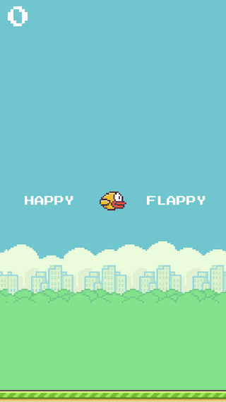

Happy Flappy Bird
=================

This is a Flappy Bird clone built using Apple's SpriteKit framework. It's a simple game that comes with two modes:

* Flappy mode: A very close clone of the original game in which you try to escape the pipes. Hitting the floor does not kill you, but this can be easily added as well.

* Happy mode: Serenity. No pipes, just flying. You never die.

We will put together more information and a tutorial on how to build this game with step by step instructions soon.
